# Rush Hour AI Solver
[](https://www.python.org/)

An interactive application built with Python and Pygame that uses classic AI search algorithms to solve the Rush Hour puzzle. Visualize and compare the performance of **Breadth-First Search (BFS)**, **Iterative Deepening Search (IDS)**, **Uniform-Cost Search (UCS)**, and **AStar** in real-time.

---
## 📖 Table of Contents

- [Motivation](#-motivation)
- [Algorithms](#-algorithms)
- [Installation & Setup](#-installation--setup)
- [How to Use](#-how-to-use)
- [Credits](#-credits)

---

## 🎯 Motivation

This project was born out of a fascination with classic AI search algorithms and a desire to see them work in a visual way. The Rush Hour puzzle provides a perfect, constrained environment to implement, visualize, and compare the performance of different pathfinding strategies.

This application serves as an educational tool to:
- **Solve** any given Rush Hour puzzle automatically.
- **Understand** how algorithms like BFS, IDS, UCS and A* navigate a complex state space.
- **Analyze** the trade-offs between different solving strategies in terms of speed, memory usage, number of expanded nodes and step counts.

---

## 🧠 Algorithms

This project implements five fundamental graph search algorithms:

-   **Breadth-First Search (BFS)**: Explores the state space level by level. It guarantees finding the *shortest* solution in terms of the number of moves, but can be memory-intensive.
-   **Iterative Deepening Search (IDS)**: A hybrid that combines DFS's space-efficiency with BFS's optimality. It performs repeated depth-limited searches, increasing the depth limit with each iteration. It finds the shortest path while using significantly less memory than BFS.
-   **Uniform-Cost Search (UCS)**: An extension of BFS that prioritizes paths with the lowest cost. Since every move in Rush Hour has a uniform cost of 1, UCS behaves identically to BFS in this application.
-   **A\* Search**: A "smart" search algorithm that uses a heuristic function to guide its path towards the goal. It combines the optimality of UCS/BFS with a goal-oriented focus, often finding the shortest path much more efficiently than other methods.

---

## 🚀 Installation & Setup

To get the project running locally, follow these steps:

1.  **Clone the repository**
    ```sh
    git clone https://github.com/NguyenAn0808/rush-hour-search-algos.git
    cd rush-hour-search-algos
    ```

2.  **Create and activate a virtual environment** (Recommended)
    ```sh
    # Create the virtual environment
    python -m venv venv

    # Activate it
    # On Windows:
    venv\Scripts\activate
    # On macOS/Linux:
    source venv/bin/activate
    ```

3.  **Install the required dependencies**
    ```sh
    pip install -r requirements.txt
    ```

4.  **Run the application**
    ```sh
    python main.py
    ```

---

## 🎮 How to Use
After launching the application, you will see the main menu. 
<table>
  <tr>
    <td width="50%" align="left">
      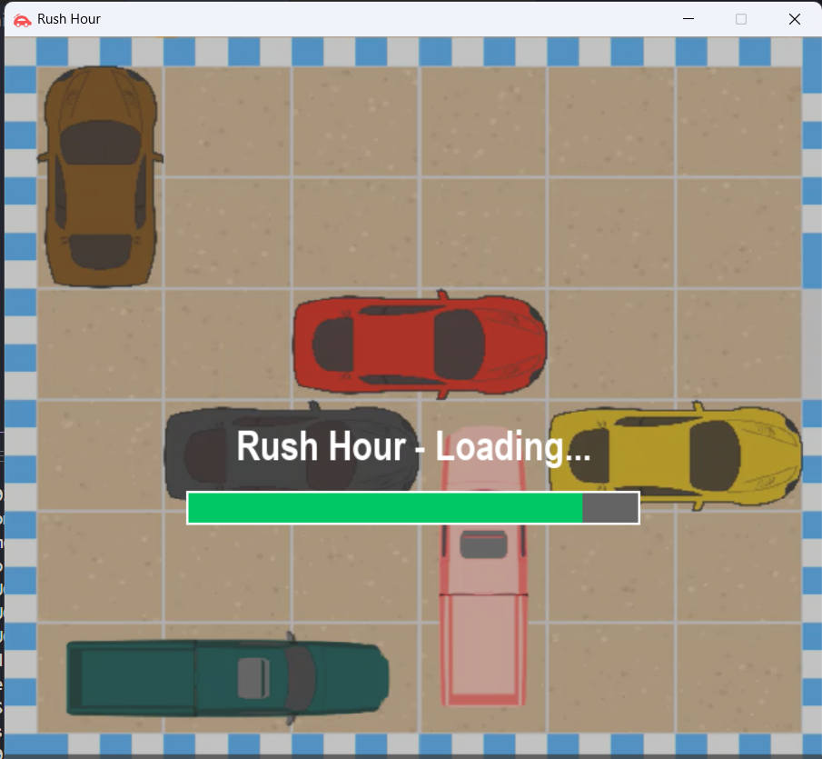
    </td>
    <td width="50%" align="right">
      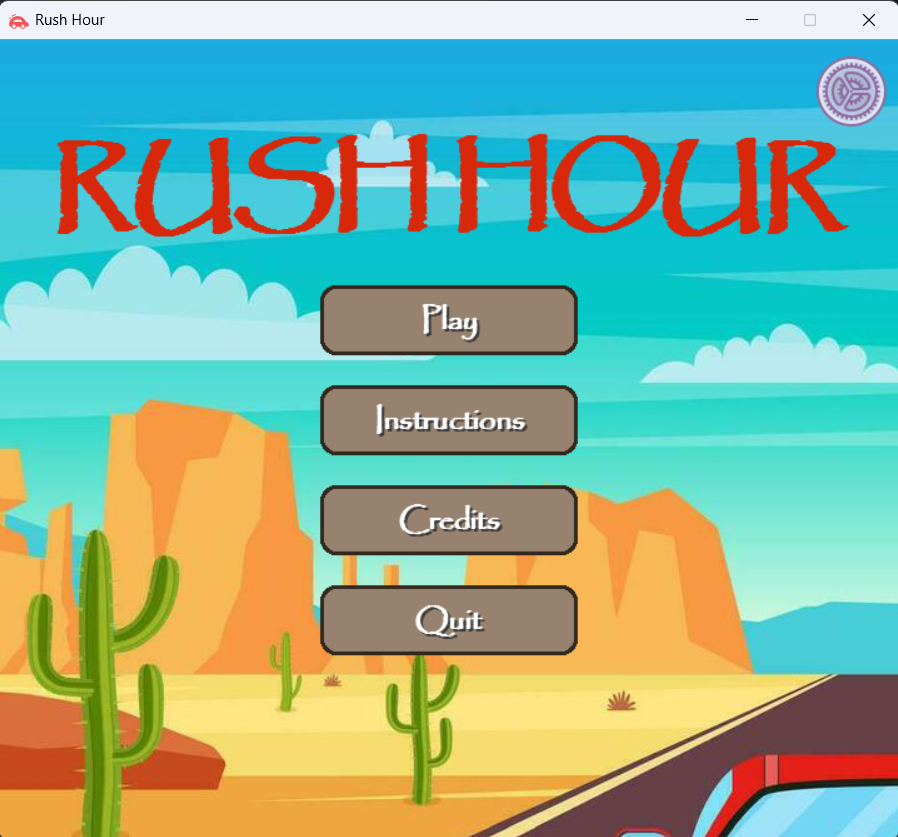
    </td>
  </tr>
</table>

This application offers two main modes: playing pre-designed **Default** puzzles or creating your own with the **Custom** map editor.

### Playing a Default Mode

Follow these steps to select and solve one of the built-in levels.

**1. Select Game Mode**
After launching the application, you will see the main menu. Click the **Play** button. A pop-up will then appear asking you to select a map type. Choose **Default** to access the pre-made levels.

<p align="center">
  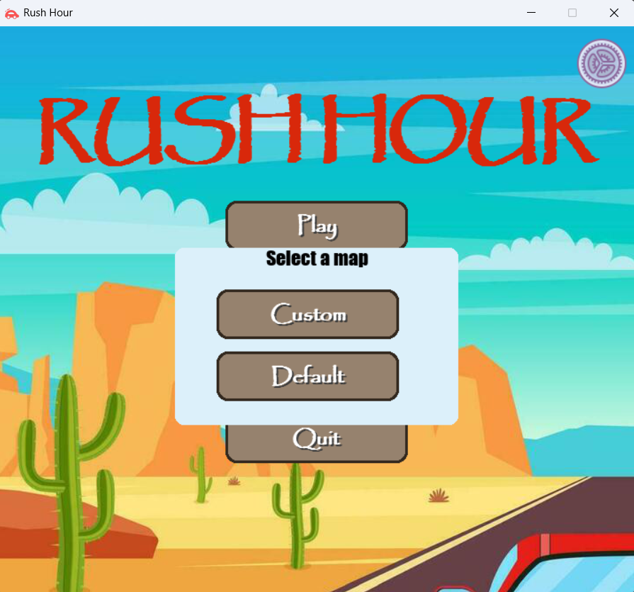
</p>

**2. Choose a Level**
Next, pick a level (1 - 15). The levels are organized by difficulty: Easy, Medium, and Hard.

<p align="center">
  
</p>

**3. Preview the Puzzle**
A preview of the board layout is shown. If you're ready, click **Start**.

<p align="center">
  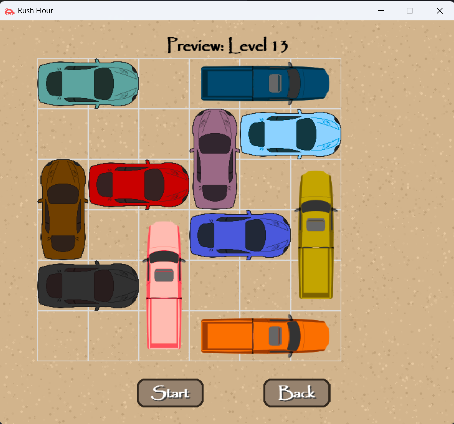
</p>

**4. Solve the Puzzle with an AI Algorithm**
This is the main solver screen.
-   First, **choose an algorithm** from the buttons at the bottom (e.g., **BFS, IDS, A\***).
-   The application will then automatically find and animate the solution.
-   You can use the **Pause**, **Reset**, or **Back** buttons at any time.

<table>
  <tr>
    <td width="50%" align="left">
      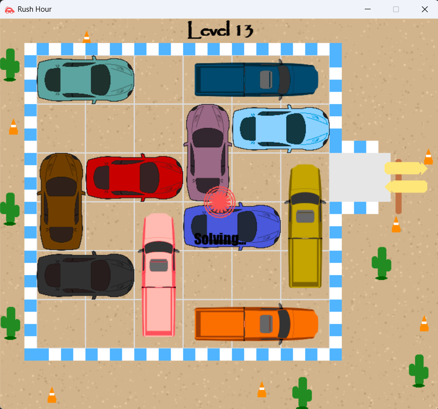
    </td>
    <td width="50%" align="right">
      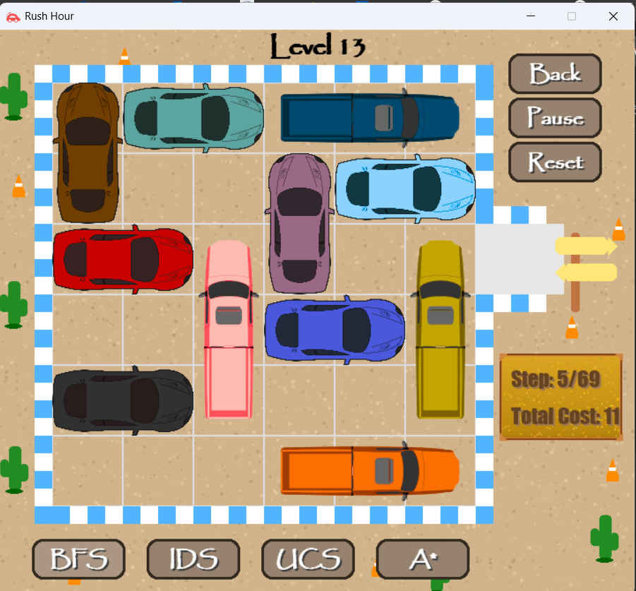
    </td>
  </tr>
</table>

**5. View the Results**
Once solved, a victory pop-up will display the performance statistics for the run, such as time, memory usage, and steps taken. If no solution is found, a message will display no solution.

<table>
  <tr>
    <td width="50%" align="left">
      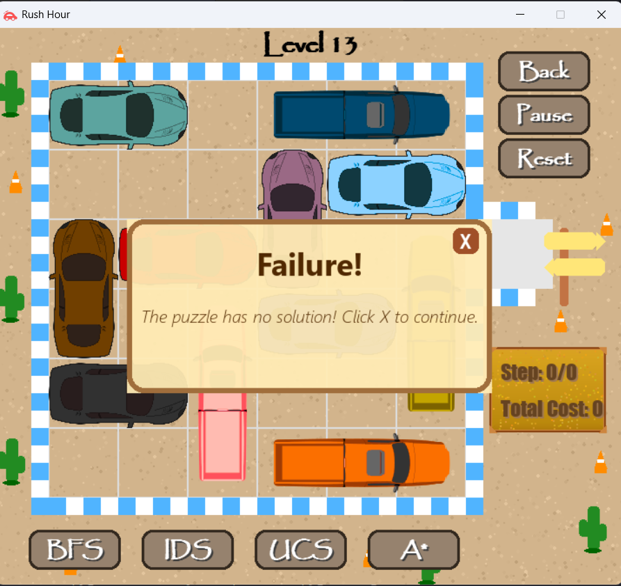
    </td>
    <td width="50%" align="right">
      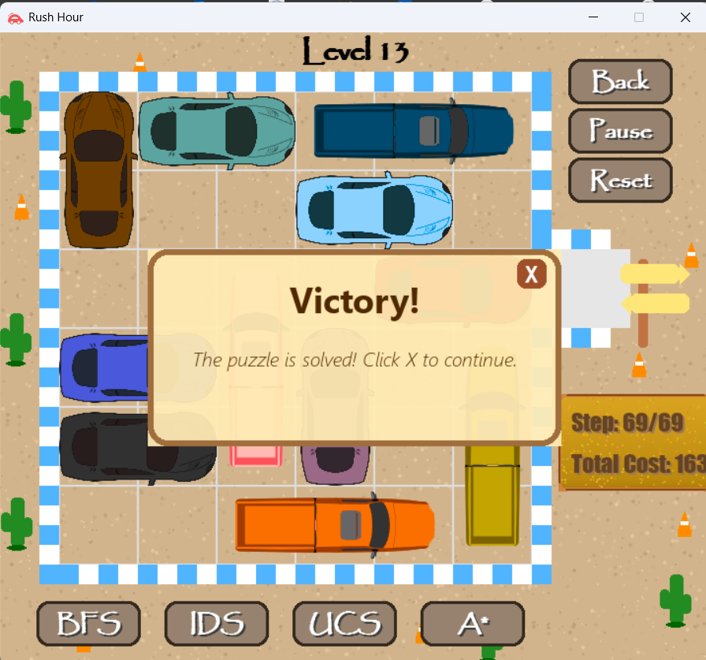
    </td>
  </tr>
</table>

### Playing a Custom Mode
**1. Design Your Puzzle Layout**
The map editor allows you to place cars one by one. The first car you place will automatically be the red "target" car.

-   Use the panel on the right to configure each vehicle before placing it.
-   Select a **Color** for your car from the palette.
-   Set the car's **Direction** (H for Horizontal, V for Vertical) and **Length** (2 or 3).
-   Click on the grid to place the configured car and Press **OK**.
-   Repeat this process for all the cars you want to add to your puzzle.

<table>
  <tr>
    <td width="50%" align="left">
      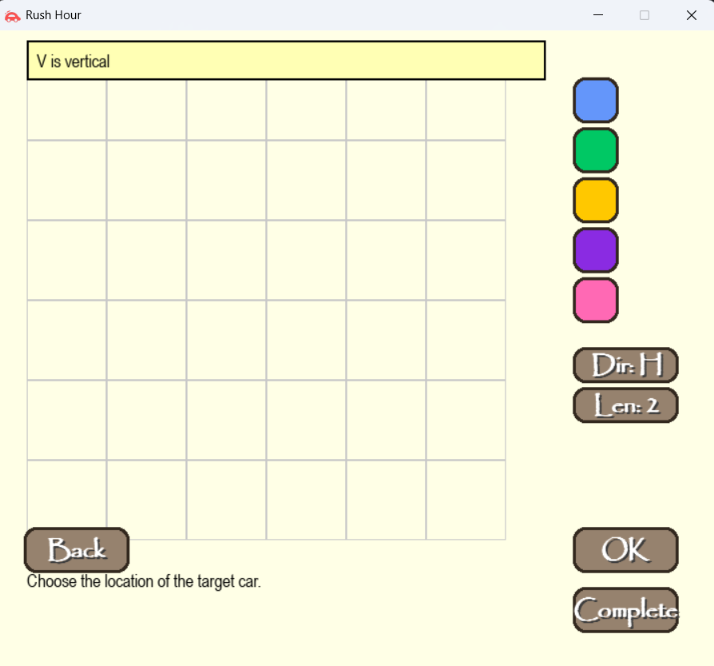
    </td>
    <td width="50%" align="right">
      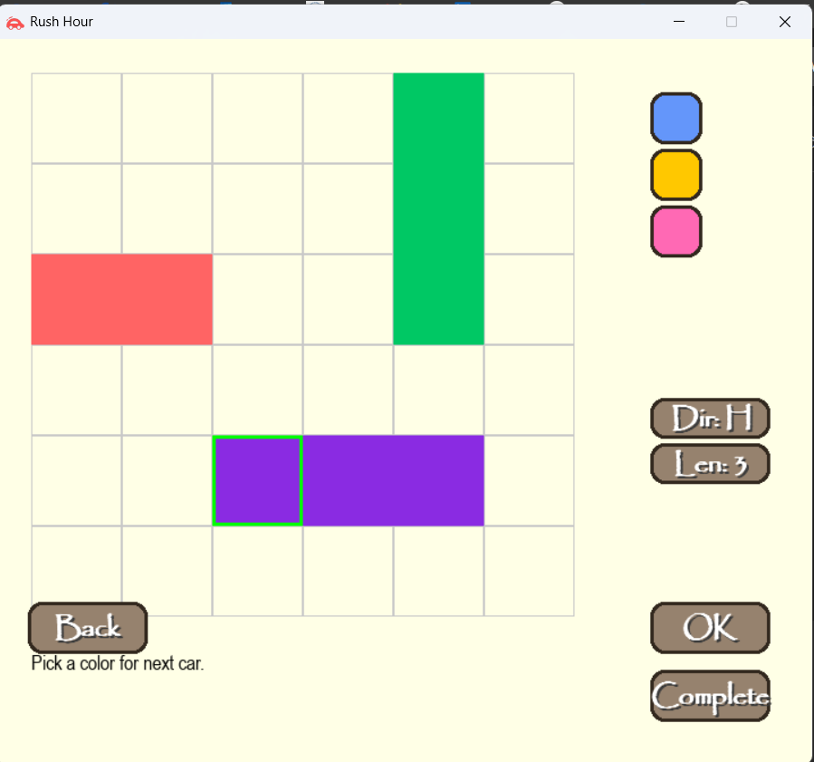
    </td>
  </tr>
</table>

**2. Finalize and Start the Puzzle**
Once you are finished with your layout, click the **Complete** button. This will generate your puzzle and take you to the solver screen.
<p align="center">
  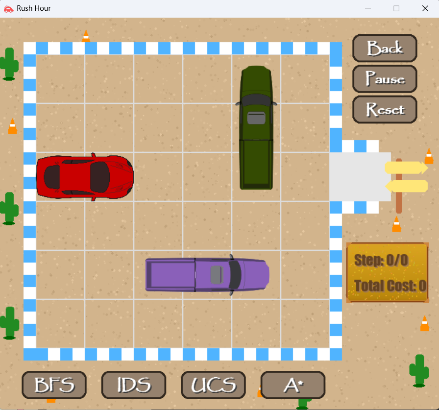
</p>

**3. Solve Your Custom Puzzle**
Your custom puzzle is now ready to be solved! Just like with default levels, choose an AI algorithm from the bottom (e.g., **BFS, IDS, A\***) to see it in action.

## 👥 Credits

This project was created and developed by: 

-   GitHub: **[phucle04](https://github.com/phucle04)**
-   GitHub: **[NguyenAn0808](https://github.com/NguyenAn0808)**
-   GitHub: **[npmthu](https://github.com/npmthu)**
-   GitHub: **[hnhan2005](https://github.com/hnhan2005)**

Feel free to reach out with any questions or feedback!

---